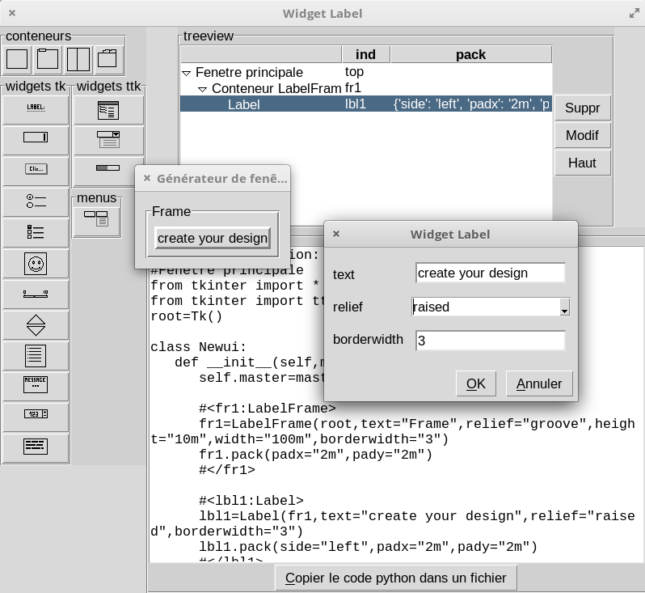

# Tkarpenter

<h1>Description:</h1>
Create a new ui with your mouse and see your widgets comming to life with tkinter. 
When you're ready, you can generate python code, save it and use it in your
 projects...

This project is in development... In my free time, i'll add translations, and finalize the options. 

Create your widgets in 3 steps :

- Select a parent in the treeview ( if different from the top window ) and choose a new widget to create

- complete the options in the dialog box or keep it as default, pack method is used to place them (no more fixed design in small windows)

- you can modify your options or wait and adjust them after exporting the generated python file.
  
  

<h1>Install</h1>

Download the last release (zip) et extract files 
Run Tkarpenter.py with python3

<h2>Dependencies/Dépendances:</h2>

You need python3 and tkinter. 
